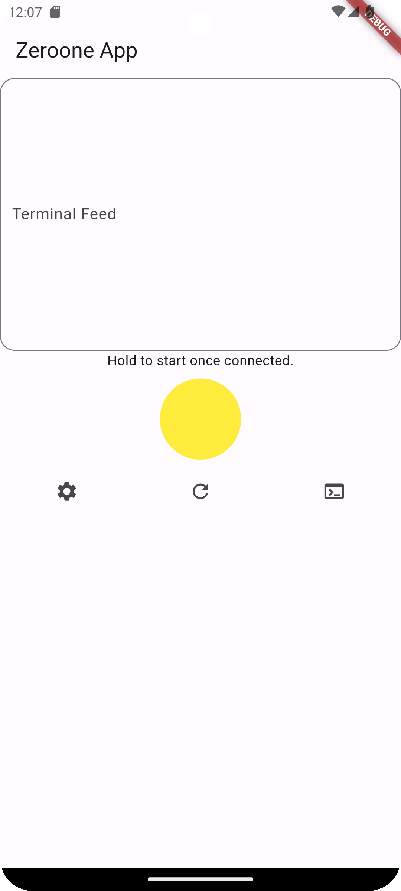

# 01 For Flutter

This is a port of the 01 Client device as a Flutter app, allowing you to forego the hardware build and directly interact with the 01 software on your computer through the app.

## What is 01?
For more on 01, you can find all you need to know [here](https://github.com/OpenInterpreter/01/). It is an open-source language model computer interaction device.

## What does the App Include?
This 01 App is made to be incredibly simple. It has three distinct features.

### 1. The speak "Button"
Made to emulate the button on the hardware models of 01, the big, yellow circle in the middle of the screen is what you hold when you want to speak to the model, and let go when you're finished speaking.

### 2. The settings button
Tapping the settings button will allow you to input your websocket address so that the app can properly connect to your computer. If you're not sure how to obtain this, read the **'How to Install'** section below!

### 3. The reconnect button
The arrow will be RED when the websocket connection is not live, and GREEN when it is. If you're making some changes you can easily reconnect by simply tapping the arrow button (or you can just start holding the speak button, too!).

## How to Install
To install this, you'll need:
- A Mac, Windows, or Linux computer with Flutter installed
- A Mac, Windows, or Linux computer or an Android device to install it on
- Since it's Flutter you can also build for other platforms, such as iOS

OR if you don't want to build it yourself, you can download the latest available build straight to your device through the repo here: [Put URL of downloads here]

### 1. Download this repository.
Seems simple enough, doesn't it?

### 3. Build and enjoy!
Follow the instructions on the 01's repo [here](https://github.com/OpenInterpreter/01/#guides) to set up the server side 01 all the way until where you get the server address that you should be inputting into the physical 01's website. Instead, input that address under the settings button of the app, and voila.

A huge thanks to the team at OpenInterpreter for their efforts to open-source AI! Make sure to check them out (obviously you'll have to, in order to get this working).
